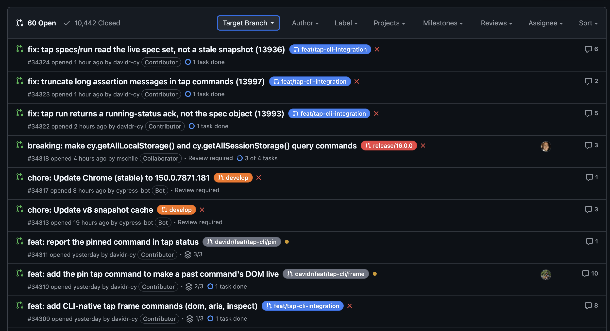
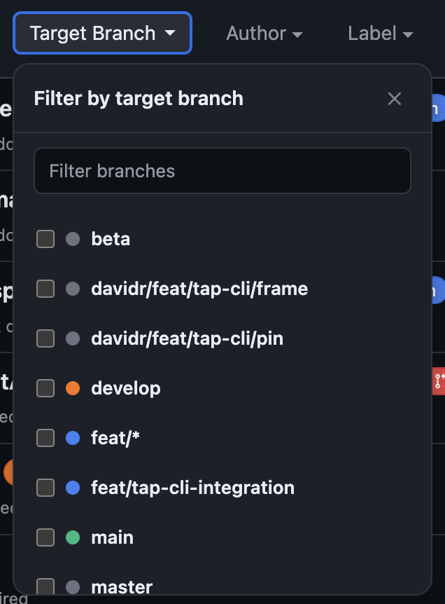
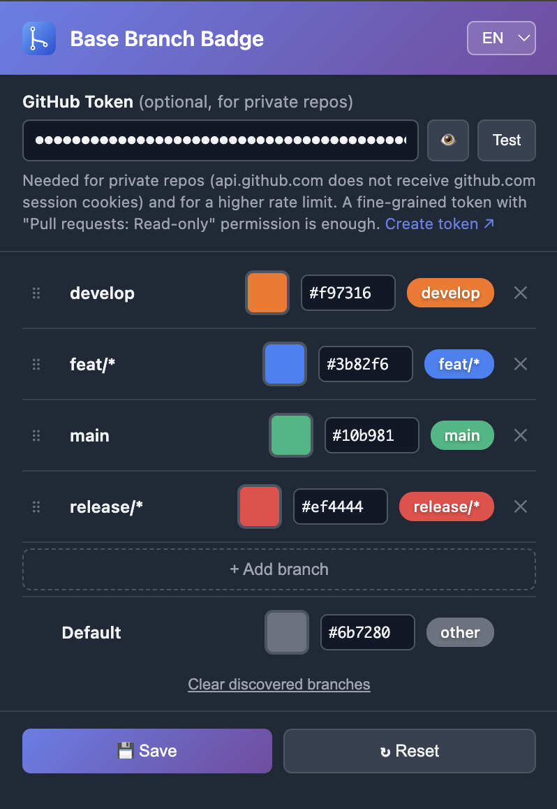

# GitHub PR Base Branch Badge Extension

A Chrome extension that shows the base (target) branch of pull requests in GitHub's PR list view as a colored badge, and lets you filter by one or more base branches.

## Features

- ✅ **Base Branch Badge** - Shows the base branch as a colored badge (PR icon + name) next to each PR
- ✅ **Click-to-Filter** - Clicking a badge instantly filters the list by exactly that base branch (open/closed filter state is preserved)
- ✅ **Multi-Select Dropdown** - "Base Branch ▾" before the Author filter, mirroring GitHub's own "Filter by author": a checkbox list of all known branches, several selectable at once, shows the number of active filters as a badge on the button
- ✅ **Popup Settings** - Customize colors per branch, add/rename/remove branches
- ✅ **Multilingual** - Language selector (English/German) in the popup, defaults to English; applies immediately to the popup and all open GitHub tabs
- ✅ **Persistent Caching** - Base branch (24h TTL) and once-seen branch names are cached in `chrome.storage.local`
- ✅ **Dark Mode Support** - Automatically adapts to the OS color scheme
- ✅ **Turbo-/Infinite-Scroll-Proof** - Works even with dynamically loaded-in PRs and when switching between the Issues/Pulls tabs, without a full page reload
- ✅ **Automatic Retry** - Transient errors (GitHub's secondary rate limit, network errors) are automatically retried on the next scan (e.g. scrolling) instead of leaving the row without a badge permanently

## Installation

No Node/npm required — just download and load the extension:

1. Download the latest release ZIP from the [Releases page](../../releases) (e.g. `github-pr-base-branch-badge-v1.0.0.zip`) and extract it
2. Open `chrome://extensions/`
3. Enable "Developer mode" in the top right
4. Click "Load unpacked" and select the extracted folder
5. Navigate to a GitHub PR list (e.g. `github.com/<org>/<repo>/pulls`)

## Usage

1. A colored badge with a PR icon and branch name appears next to every PR
2. **Clicking a badge** filters the list by exactly that base branch
3. **"Base Branch ▾"** opens a dropdown with checkboxes for all known branches — several can be checked at once, the selection applies immediately; the number on the button shows the count of active filters
4. **Clicking the extension icon** opens the settings popup: change colors, add/rename/remove branches, set/test a token, switch language (EN/DE, applies immediately), reset discovered branches, save

### Default branch colors

Out of the box, the popup ships with four example entries — `main`, `develop`, `staging`, and a `release/*` wildcard (matching `release/1.0`, `release/my-feature`, ...) — plus the `default` fallback color for everything else. These are just a starting point: add, rename, or remove entries in the popup to match your own repo's branches.

### Wildcard patterns and priority

A branch entry's name can be a `*`-wildcard pattern instead of an exact name (e.g. `release/*` matches `release/1.0`, `release/2.0`, ...) — handy for repos with many similarly-named branches instead of adding one entry per branch. An exact name always wins over a pattern; if several patterns match the same branch, the **topmost** one in the popup wins. Drag a row by its grip handle (⠿) to reorder it and change its priority.

### Using it on private repos / raising the rate limit

By default the extension works unauthenticated on public repos (60 API requests/hour, shared browser-wide). For private repos, or a higher limit (5000/hour), set a GitHub Personal Access Token in the popup — a fine-grained token with "Pull requests: Read-only" is enough. If a repo belongs to an organization and you get a 404 despite a set token, either get the org to approve fine-grained tokens, or use a classic token with the `repo` scope instead (see Troubleshooting below).

## Troubleshooting

Badge not showing up?

- Reload the page (F5)
- Check the extension in `chrome://extensions/` for errors
- Check the browser console (F12) for `Base Branch Badge:` warnings — a `404` on private repos without a token means: token missing; a `403` means: rate limit reached, add a token (or a different token with a higher limit)

404 despite a set token, on an organization repo?

- Fine-grained tokens with "All repositories" only apply to repos personally owned — repos belonging to an organization (e.g. `hafele-group-it`) are excluded from that until the organization has explicitly allowed/approved fine-grained token access (org settings → Personal access tokens)
- Faster workaround: create a **classic token** with the `repo` scope (`github.com/settings/tokens` → "Generate new token (classic)") — doesn't need org approval, unless the organization enforces SSO (then authorize the token once via "Enable SSO" for the org)

Popup doesn't open?

- Pin the extension icon in the toolbar (puzzle icon 🧩 → Pin)
- Alternatively: `chrome://extensions/` → Details → "Extension options" no longer exists, settings run exclusively through the popup

A branch is missing from the filter dropdown?

- It must have been visible as a badge at least once (or be configured in the popup's color settings) for it to land in `discoveredBranches`

## Known Limitations

- Every newly seen PR causes an extra API request to determine the base branch (only once per PR thanks to caching)
- Without a token set: public repos only, 60 API requests/hour (shared across all extensions/tools that access the GitHub API unauthenticated)
- Branch name matching is case-sensitive and must exactly match GitHub's name
- `discoveredBranches` only grows (no automatic cleanup) — deleted/renamed branches remain visible in the filter dropdown until "Reset discovered branches" is manually triggered in the popup
- Language selection (EN/DE) only covers text rendered by the extension itself (badges, filter dropdown, popup) — not GitHub's own interface
- `github.com` only, no GitHub Enterprise Server (own domain) — `manifest.json` would need to be extended with the corresponding domain for that

<strong>🛠️ Development</strong>

Only needed if you're working on the code itself — not for plain use of the extension.

### Setup

1. `npm install` (once)
2. `npm run build` — compiles `src/**` into `dist/`, the directory `manifest.json`/`popup.html` reference (doesn't exist before the first build, isn't part of the repo)
3. Open `chrome://extensions/`, enable "Developer mode", "Load unpacked" → select this folder (not `dist/`) — `manifest.json` lives at the root and references `dist/*` internally

Other scripts:

- `npm run watch` — rebuilds automatically on every change under `src/`
- `npm run lint` / `npm run format` / `npm test` — ESLint, Prettier, Node's built-in test runner (`node --test`)
- `npm run package` — builds fresh and produces the release ZIP under `release/` (exactly what the `Release` workflow publishes automatically on a version tag)
- After changes under `src/content/` or `src/styles/`: rebuild, reload the extension in `chrome://extensions/`, then reload the GitHub tab
- After changes to `src/popup.js`: rebuild, just reopen the popup (no extension reload needed)

### Creating a release

1. Bump `manifest.json`'s `"version"`, commit
2. Push a `vX.Y.Z` tag (matching the new version) — `.github/workflows/release.yml` builds, tests, packages, and publishes the ZIP as a GitHub Release automatically

### Branch colors

`popup.js` manages a color map (`branchColors`) in `chrome.storage.local`. Branch names are freely chosen (rename/add/remove in the popup) — `content.js` looks up the color generically by branch name and falls back to the "default" color if no entry exists. After saving, the popup sends a `reloadBadges` signal to all open GitHub tabs, which removes existing badges and redraws them with the new colors (from the in-memory cache, without a new network request).

A key may also be a `*`-wildcard pattern (e.g. `release/*`, `*-staging`) instead of an exact branch name. `resolveBranchColor()` in `src/content/utils.js` (used by both the badge and the filter dropdown's color dot) checks for an exact match first, then the wildcard patterns in `branchColors`' insertion order — i.e. the popup's row order, top to bottom — and only then falls back to `default`.

Each row in the popup (`buildRow()` in `src/popup.js`) is one `.branch-row` element (a small CSS Grid: handle, name, swatch, hex, preview, remove), which is what makes native HTML5 drag-and-drop reordering possible — dragged by the grip handle (⠿) at the start of the row rather than the row as a whole, so starting a drag doesn't fight with text selection in the name/hex inputs. `dragstart` calls `dataTransfer.setDragImage(rowEl, ...)` so the whole row (not just the small handle) follows the cursor, and `dragover` shows a thin insertion-line indicator (`.drop-indicator-before`/`-after`, an inset `box-shadow` so it doesn't shift row height) at whichever edge of the hovered row the cursor is closer to. `moveRowTo()` then does a plain `insertBefore()` of the dragged row's element on drop — no index bookkeeping or rebuilding through the `branchColors` object needed, which would require unique keys and could silently collapse rows sharing a duplicate/empty name while mid-edit.

### Multi-selection in the filter

GitHub treats repeated `base:` qualifiers in search as OR, not AND — `base:master base:beta` matches PRs with base `master` **or** `beta`. The query helpers in `src/content/query.js` (`getSelectedBaseBranches`, `buildQueryForBaseBranches`, `navigateToQuery`) rely on exactly this behavior; clicking a badge, by contrast, deliberately sets just a single branch (replacing the current selection) — the dropdown is the way to select multiple.

### Navigation between Issues and Pulls

GitHub uses Turbo (Hotwire) for navigation between `/issues` and `/pulls` — the URL changes via the History API without a real page reload. For the badges/dropdown to still appear reliably:

- The manifest matches `https://github.com/*` broadly instead of just `*/pulls*`/`*/issues*` — PR detail pages (`/pull/<n>`, singular) are a distinct pattern, and whoever lands there first (or navigates list → detail → list via Turbo) must not be left without the injected script. `content.js` itself decides, via `isPRListPage()`, where anything actually happens.
- `content.js` reacts to the `turbo:load` event and re-attaches the `MutationObserver` to the current `document.body` on every navigation — GitHub sometimes replaces this element wholesale on certain navigations, which would otherwise disconnect an old observer.
- Changes to the filter selection (checkbox, badge click), on the other hand, trigger a real page reload (confirmed by observation), not just a Turbo soft navigation.

